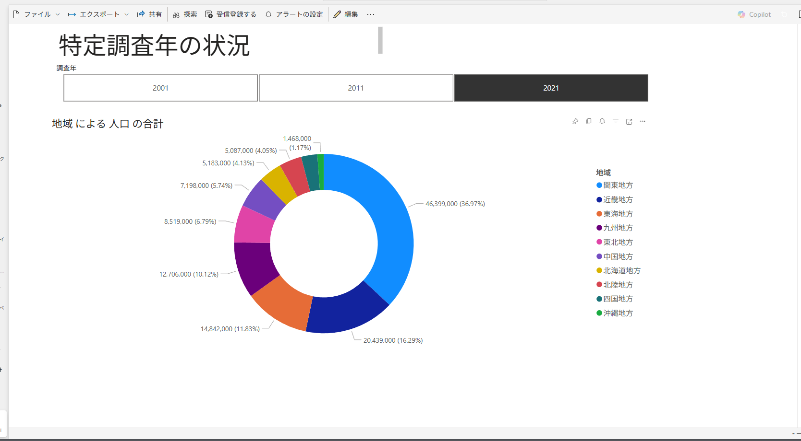

# 📊 Population Dashboard (Power BI)

This dashboard visualizes population data across different regions of Japan for the years 2001, 2011, and 2021.

## Features
- Donut chart showing population share by region
- Year filter using slicer buttons
- Color-coded legend for quick reference
- Built entirely in Power BI Desktop

## Purpose
Created as a hands-on project while taking a Udemy Power BI course. This is my first Power BI dashboard, aiming to demonstrate basic data modeling, visual formatting, and interactivity.

## Screenshot

